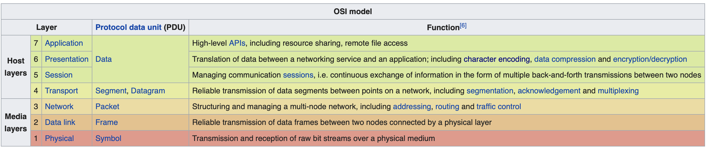

# Lab 1 Milestone 1: Handshake

## Overview

Creating a "session" layer for Playground.

In real life, putting in a network protocol lower than the application layer requires a device driver.

Playground allows you to insert a protocol stack between the wire protocol and the application protocol using a ["connector.”](./PlaygroundPassthroughQuickstart)

## OSI



## Info

Auto-grade client will be provided , which need the connector installed at the playground (with the name assigned by the PETF)

On the due day, The address and port of the autograder will be (SAFE NETWORK):

```
20194.0.0.19100 and port 19101
```

The auto-grader will test handshakes in both directions. You will be graded as follows

- 25 points for correct client-side three-way handshake
- 25 points for correct server-side three-way handshake
- 25 points for correct handling of dropped or corrupted handshake packets

## Steps

- [x] Run echo test and figure out how make connection

* Transmitting whatever packets are needed between itself and its peer.

- [x] PETF Naming the Lab 1 Protocol by due date
- [x] Write handshake with required properties
- Only once the connection is established (the handshake is complete) should the higher layer know that the connection is made.
- Once the higher layer (the application layer) can connect, you can provide it a "pass through" transport.
- For now, just allow communications to travel directly through without modification or processing.
- Experiment with this concept is not required but welcomed.
- [x] Write the PRFC
- [x] Deploy handshake
- [ ] Pass auto grater

## Handshake code

1. At initialization, the client will set its SYN to be any random value between 0 and 254, server will set its SYN anything between 0 and 254 and its ACK any random value between 1 and 254. </t>
2. The client needs to send a packet with SYN and status NOT STARTED to the server to request a connection.
3. Upon receiving the packet, the server sends back a packet with SYN+1, ACK set to 0 and status SUCCESS.
4. Upon receiving the SUCCESS packet, the client checks if new SYN is old SYN + 1. If it is correct, the client sends back to server a packet with ACK set to 1 and status SUCCESS and acknowledge this connection with server. Else, the client sends back to server a packet with status set to ERROR.
5. Upon receiving the SUCCESS packet, the server checks if ACK is 1. If success, the server acknowledges this connection. Else, the server sends back a packet to the client with status ERROR.

## The Handshake

“handshake” is for creating a session

> Similar to TCP's 3-way handshake. You do not need to follow TCP's model in any way, but you must get the same properties. Specifically:

### Properties

1. Establish a _new_ connection
   > (that is, you can tell one connection from another)
2. Both sides must be aware of the other before the connection is "established"
3. Server can tell the client that the connection cannot be established
   > (e.g., that there was an error or otherwise something went wrong).
4. While you haven't yet figured out how you're going to do the reliable delivery, any setup information must be communicated as part of the handshake.
   > You can modify the handshake later as needed for subsequent parts of this lab.

## Echo test

### Install passthrough

- Module location: `src/samples/passthrough`
- Instal the module into `.playground/connectors` directory.

### Echo test

You can test out the passthrough stack with the echo test source code, in`src/test`  
To start the server:

```
python echotest.py server -stack=passthrough
```

To start the client:

```
python echotest.py localhost 101 -stack=passthrough
```
